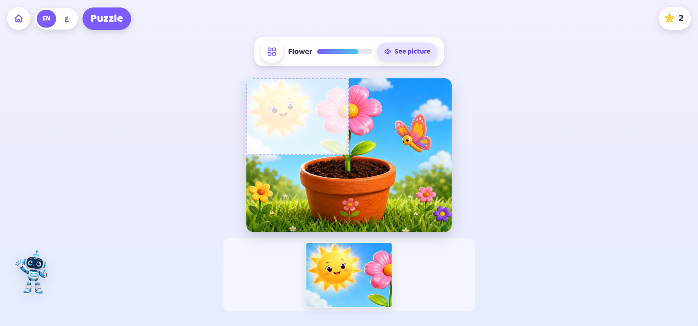
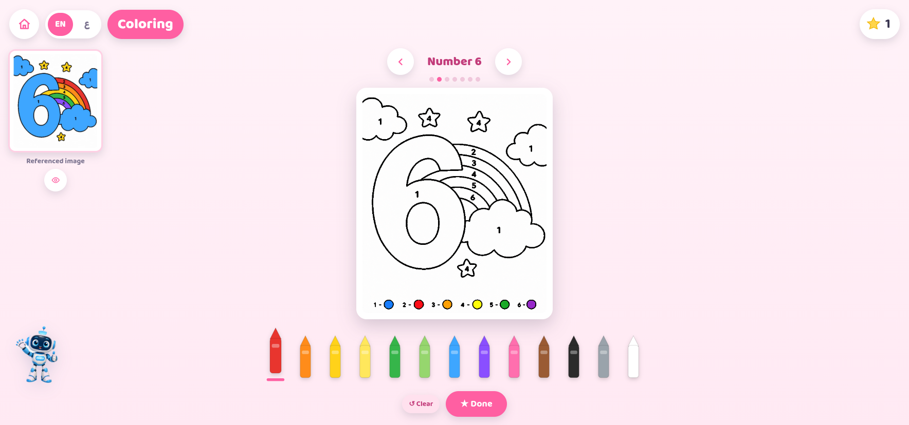
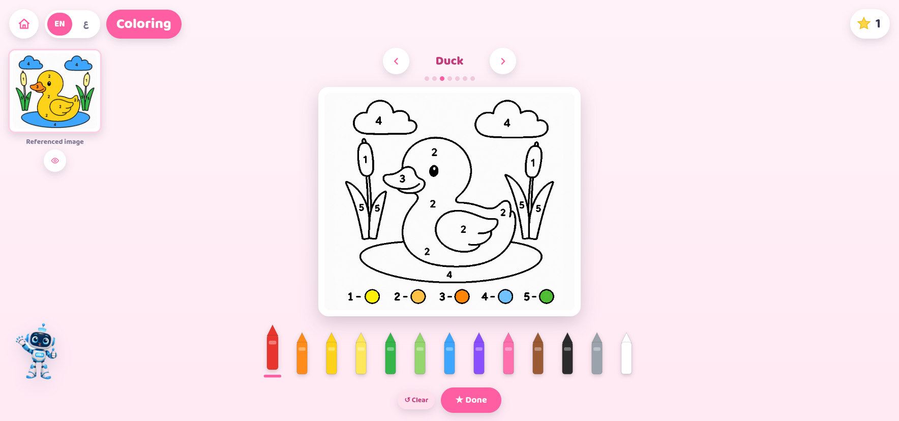
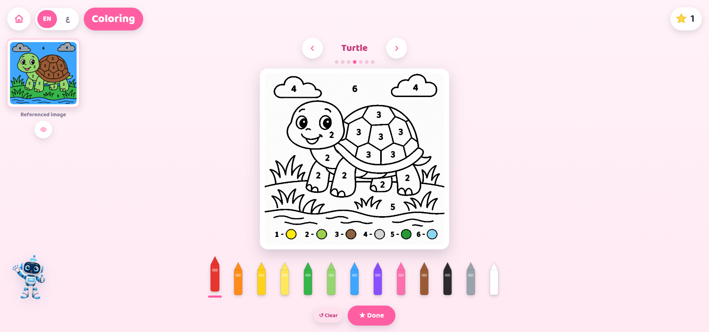
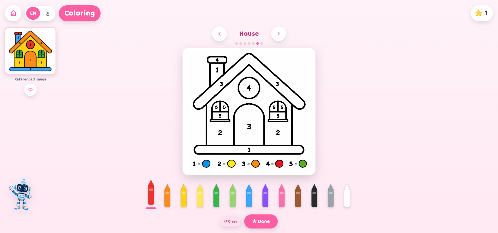
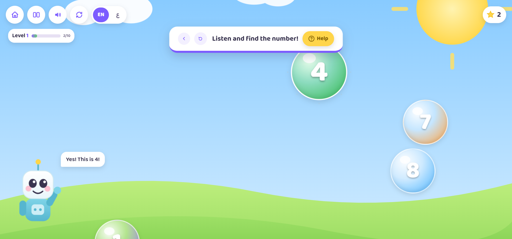
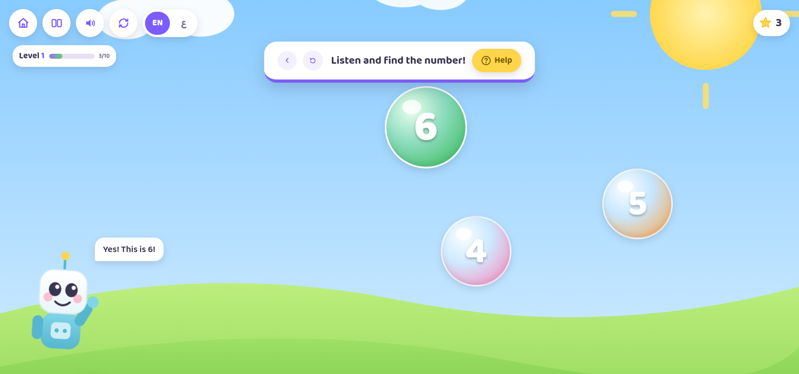
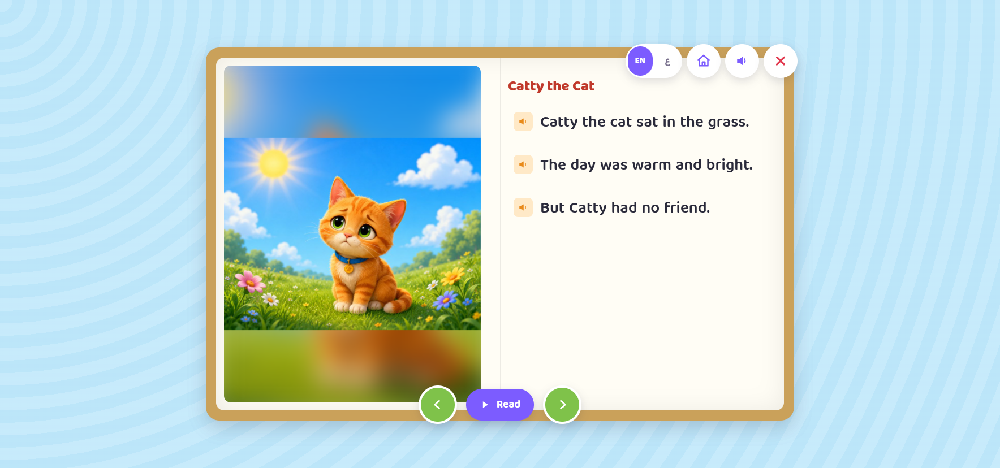
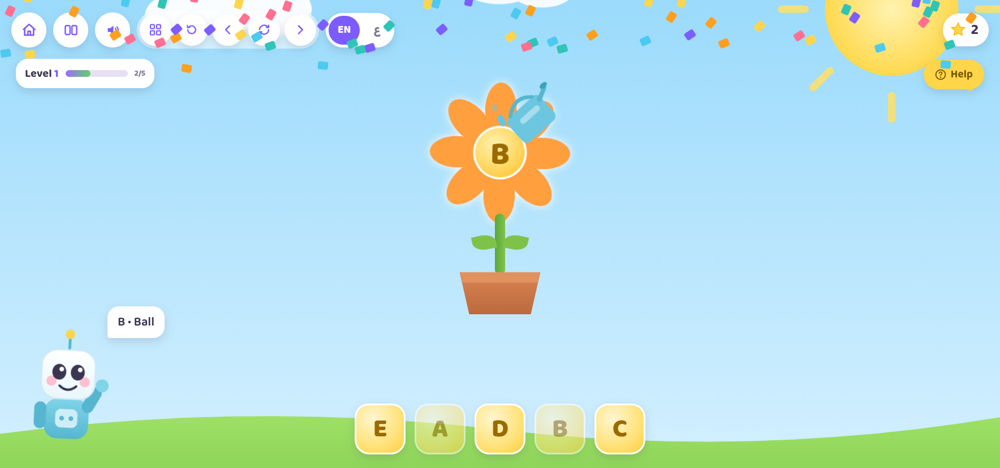

<h1 align="center">EMRA</h1>

<b>Educational Multimodal Robot Assistant</b>

A bilingual Arabic and English social robot for children with autism spectrum disorder.

  

EMRA runs an activity suite on a touchscreen mounted on the robot's chest, with
an animated face on a circular head display. A conversational track listens to
the child, reads emotion from both speech and facial expression, and replies in
the language of the session. Ten activities cover conversation, body awareness,
visual matching, construction, colour, early numeracy, handwriting, shared
reading and letter work. An educator view reports progress per child and per
group, and generates written progress notes.

|  |  |
| --- | --- |
| Displays | 1080 x 1080 circular head, 1768 x 828 chest touchscreen |
| Languages | English and Arabic, with right to left layout |
| Robot side | Raspberry Pi 5 |
| Inference side | Workstation with an RTX 4080, English on port 8000, Arabic on port 8001 |

Every screen below is from the deployed system.

---

## Overview and session start

The chest touchscreen is the child's only point of contact with the system. It
opens on a menu of ten activities. An educator starts a session by entering the
child's name, age, identifier and gender, or continues as a guest when no
record is needed. Everything the child then does is logged against that
session, which is what the educator dashboard later reports on.

The activity set was shaped by the categories of application already in
routine use in autism therapy: communication and conversation practice,
body and self awareness, visual matching and construction, colour and shape
work, early numeracy, handwriting and tracing, shared reading, and letter and
phoneme work. EMRA covers those categories in one bilingual system running on
the robot rather than across separate tablet applications.

<table>
<tr>
<td width="50%"> Main menu. Ten activities, the educator entry point at the left, and the session start panel at the right.</td>
<td width="50%"> The session start panel rejects an empty form, so a child record or an explicit guest choice is always made before an activity opens.</td>
</tr>
</table>

## Puzzle

Visual matching and spatial reasoning. Four pictures are offered across four
levels, with the piece count rising from two to six. The reference picture can
be shown on demand. Levels unlock in order, and a free play mode lets the child
replay anything already unlocked without the level gate.

<table>
<tr>
<td width="50%"> Level selection. Four levels, unlocked in order, with the piece count rising from two to six.</td>
<td width="50%"> The same screen in Arabic. Layout, level order and progress state mirror to right to left.</td>
</tr>
<tr>
<td width="50%"> Level one, two pieces. The reference picture is available on demand from the bar above the board.</td>
<td width="50%"> Completion feedback. The solved picture is shown and the next level is unlocked.</td>
</tr>
<tr>
<td width="50%"> Level two, four pieces.</td>
<td width="50%"> Level three, six pieces, with the unplaced pieces held in the tray below the board.</td>
</tr>
<tr>
<td width="50%"> Free play. Any unlocked picture can be replayed without the level gate.</td>
<td></td>
</tr>
</table>

## LEGO build

Block construction against a target model. The target is displayed beside an
empty grid and the child drags bricks from the tray to reproduce it. Eight
models are available, ordered by the number of bricks and the number of
distinct colours involved.

<table>
<tr>
<td width="50%"> Level selection across eight target models, ordered by brick count and by the number of distinct colours.</td>
<td width="50%"> Building in progress. The target model sits at the top left, the working grid in the centre, and the available bricks in the tray below.</td>
</tr>
</table>

## Painting

Colour by number. Each template pairs a line drawing with a numbered key, and
the child selects the crayon whose number matches the region. The reference
image stays visible for comparison. Seven templates run from five regions to
eight, so difficulty rises through both region count and region size.

<table>
<tr>
<td width="50%"> Colour by number with five regions. The numbered key sits under the drawing and the reference image stays visible at the left.</td>
<td width="50%"> Template combining numeral recognition with colour matching.</td>
</tr>
<tr>
<td width="50%"> Five region template.</td>
<td width="50%"> Six region template.</td>
</tr>
<tr>
<td width="50%"> Six region template with clustered small regions, which raises the precision needed.</td>
<td width="50%"> Five region template.</td>
</tr>
<tr>
<td width="50%"> Eight region template, the hardest in the set.</td>
<td></td>
</tr>
</table>

## Colours

Two colour activities. The matching game asks the child to connect each named
crayon to its swatch, which tests colour naming rather than colour perception
alone. The discovery board presents eleven colour names, speaks each one, and
plays a short fill animation with the written word so the spoken name, the
written name and the colour are presented together.

<table>
<tr>
<td width="50%"> Entry screen for the two colour activities.</td>
<td width="50%"> Colour matching. Each named crayon is dragged to its swatch, so the task tests the colour name and not only the colour.</td>
</tr>
<tr>
<td width="50%"> Feedback shown once every pair is matched.</td>
<td width="50%"> Colour discovery board with eleven named colours, each spoken when selected.</td>
</tr>
<tr>
<td width="50%"> Fill animation played after a colour is chosen.</td>
<td width="50%"> The written colour word shown with the spoken name, pairing the two forms.</td>
</tr>
</table>

## Numbers

Early numeracy in two forms. Numeral tracing shows a dotted guide with a marked
starting point and speaks the number name as the stroke is completed. The
listening task speaks a number and asks the child to find it among floating
bubbles, which separates recognising the spoken word from producing the shape.

<table>
<tr>
<td width="50%"> Numeral tracing. The dotted guide carries a marked starting point and the number name is spoken as the stroke is made.</td>
<td width="50%"> Completed trace with confirmation feedback.</td>
</tr>
<tr>
<td width="50%"> Listening task. A number is spoken and the matching bubble must be found, which separates hearing the word from writing the shape.</td>
<td width="50%"> Listening task with correct answer feedback delivered by the on-screen robot.</td>
</tr>
<tr>
<td width="50%"> Final item of level one.</td>
<td></td>
</tr>
</table>

## Writing

Handwriting and spelling. Word tracing shows a faded guide word inside the
writing area and fills each letter in colour as it is traced, in English and in
Arabic. The Arabic levels use connected letter forms with diacritics, so the
task is not a mirror of the English one. The spelling activity shows a picture
and asks the child to place letter tiles in order to build the word.

<table>
<tr>
<td width="50%"> Word tracing level selection, three levels.</td>
<td width="50%"> Tracing task before the first stroke. The guide word sits faded inside the writing area.</td>
</tr>
<tr>
<td width="50%"> Tracing in progress. Each letter fills with colour as it is completed.</td>
<td width="50%"> Success feedback with the pictured word, offering repetition or progression.</td>
</tr>
<tr>
<td width="50%"> Arabic word tracing level selection.</td>
<td width="50%"> Arabic tracing in progress, using connected letter forms with diacritics rather than a transliteration of the English task.</td>
</tr>
<tr>
<td width="50%"> Spelling activity level selection, four levels.</td>
<td width="50%"> Spelling. Letter tiles are placed in order to build the pictured word.</td>
</tr>
<tr>
<td width="50%"> Success feedback with the completed word.</td>
<td></td>
</tr>
</table>

## Reading

Shared reading. Three short illustrated stories are narrated sentence by
sentence with the spoken word highlighted in the text, so the child follows the
written form while hearing it. Pages advance manually, which lets an educator
hold on a page for as long as the child needs.

<table>
<tr>
<td width="50%"> Contents page listing three illustrated stories with their length.</td>
<td width="50%"> Story page during narration. The word being spoken is highlighted in the text.</td>
</tr>
<tr>
<td width="50%"> Second story. Pages advance manually so an educator can hold on a page.</td>
<td width="50%"> Third story.</td>
</tr>
</table>

## Letters

Letter work in two forms. In the recognition game the child picks a letter
tile from a row and a correct choice grows a flower and speaks an example word
beginning with that letter. Letter tracing then asks the child to produce the
shape, using the same dotted guide and start marker as the numeral task.

<table>
<tr>
<td width="50%"> Letter recognition. A letter is named and the child picks the matching tile from the row.</td>
<td width="50%"> Correct choice. The flower grows and an example word beginning with the letter is spoken.</td>
</tr>
<tr>
<td width="50%"> A later item in the same level.</td>
<td width="50%"> Letter tracing, using the same dotted guide and start marker as the numeral task.</td>
</tr>
<tr>
<td width="50%"> Completed trace with praise from the on-screen robot.</td>
<td></td>
</tr>
</table>

## Administrator panel

Maintenance functions behind an administrator sign in. The panel restores the
head servos to their neutral position on each rotation axis, which is needed
after transport or after a session in which the head was moved by hand.

<table>
<tr>
<td width="50%"> Administrator sign in, which keeps maintenance functions out of reach during a session.</td>
<td width="50%"> Head servo calibration. Each rotation axis can be returned to its neutral position after transport or manual handling.</td>
</tr>
</table>
